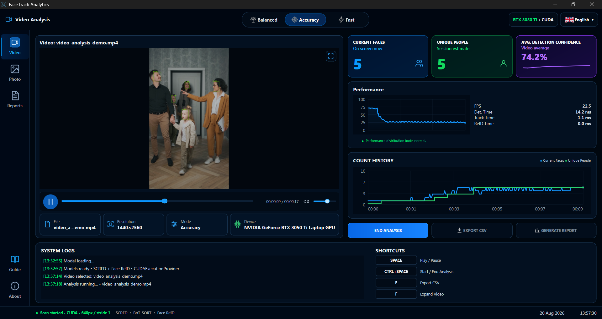
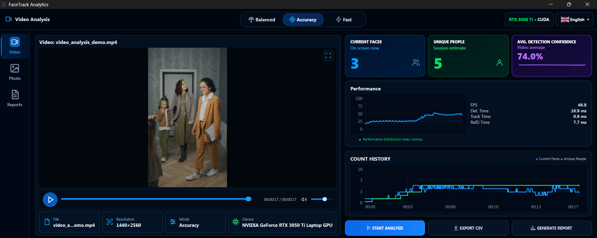
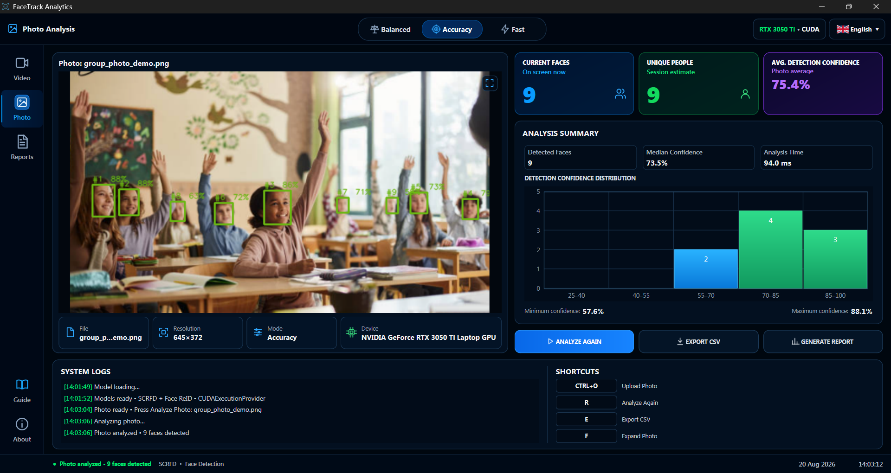
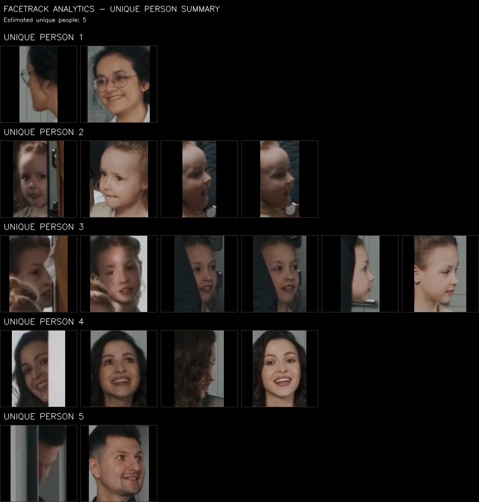
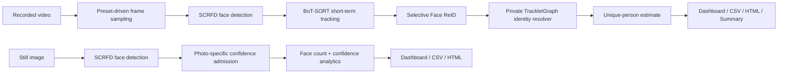

<p align="center">
  
</p>

<h1 align="center">FaceTrack Analytics</h1>

<p align="center">
  Windows desktop analytics for face detection, short-term tracking, Face ReID, and unique visible-person estimation in recorded video and still images.
</p>

<p align="center">
  
  
  
  
</p>

<p align="center">
  <a href="docs/architecture.md">Architecture</a> ·
  <a href="docs/validation.md">Validation</a> ·
  <a href="docs/system-requirements.md">System Requirements</a> ·
  <a href="CHANGELOG.md">Changelog</a>
</p>



## Overview

FaceTrack Analytics is a local Windows desktop application for analyzing prerecorded video and still images. In video mode, it combines face detection, short-term tracking, selective face embeddings, and a session-level identity resolver to estimate how many distinct visible people appeared during the analysis. Photo mode performs single-image face detection and confidence-based admission without temporal tracking.

The project focuses on an end-to-end engineering workflow: desktop UX, local inference, CUDA/CPU provider handling, runtime telemetry, validation, exports, and portable Windows packaging.

> **Scope note:** the result is an estimate based on visible faces. FaceTrack Analytics does not identify people by name and should not be presented as biometric attendance verification.

## Visual demonstration

### Video analytics



The video workspace exposes current visible faces, the running unique-person estimate, average detection confidence, runtime FPS, per-stage timing, and count history.

### Photo analytics



Photo mode uses a single-frame detection path and provides detected-face count, confidence statistics, a confidence histogram, and export/report actions.

### Unique-person summary



A naturally completed video analysis can generate a clean visual summary that groups representative face crops under the final unique-person estimate.

## Key features

- **Video analysis:** face detection, short-term tracking, selective Face ReID, session-level unique-person estimation, live count history, and runtime telemetry.
- **Photo analysis:** single-image face detection with photo-specific confidence admission and confidence distribution visualization.
- **Three analysis presets:** Balanced, Accuracy, and Fast, providing qualitative speed/recall trade-offs without requiring users to edit configuration files.
- **Hardware-aware inference:** NVIDIA CUDA acceleration when available, with automatic CPU fallback when CUDA is unavailable.
- **Exports:** video/photo CSV export, localized HTML analysis reports, and automatic unique-person summary output for completed video sessions.
- **Desktop UX:** native Windows title bar behavior, fullscreen media viewer, keyboard shortcuts, responsive sidebar/navigation, and English/Türkçe UI.
- **Local-first workflow:** media analysis runs on the local machine; the packaged application does not depend on cloud inference.

## How it works



The production TrackletGraph identity-resolution implementation and calibrated decision rules are intentionally not included in this public portfolio repository. See [Architecture](docs/architecture.md) for the component-level view.

## Technology stack

| Area | Technology |
| --- | --- |
| Language | Python 3.11 |
| Desktop UI | PySide6 / Qt 6 |
| Face detection & embeddings | InsightFace / SCRFD / face-recognition embeddings |
| Tracking | BoT-SORT integration via BoxMOT |
| Inference runtime | ONNX Runtime |
| GPU acceleration | NVIDIA CUDA execution provider |
| Image/video processing | OpenCV, NumPy |
| Windows packaging | PyInstaller ONEDIR |

## Validation

Validation was performed with manually verified unique-person ground truth on labeled development, holdout, and stress scenarios. Test media are not included publicly.

| Evaluation | Runs | Exact | Within ±1 | MAE |
| --- | ---: | ---: | ---: | ---: |
| Video development set | 30 | 27/30 | 30/30 | 0.100 |
| Video holdout/regression set | 18 | 15/18 | 18/18 | 0.167 |
| Video stress variants | 36 | 28/36 | 34/36 | 0.278 |
| Photo fresh holdout | 18 | 14/18 | 18/18 | 0.222 |

These figures describe the project’s internal test scenarios, not universal accuracy guarantees. See [Validation methodology](docs/validation.md) for context and limitations.

## Installation

### Windows release

The application is packaged as a **Windows x64 PyInstaller ONEDIR** build. The entire release folder must remain together; the executable should not be separated from its `_internal` runtime directory.

The portable release asset is named:

```text
FaceTrack-Analytics-v1.0.0-Windows-x64-Portable.zip
```

The packaged build is designed so normal users do **not** need to install Python, CUDA Toolkit, or cuDNN separately. A compatible NVIDIA driver is required for CUDA acceleration. When a CUDA-capable NVIDIA GPU is unavailable, the application falls back to CPU execution and may run substantially slower.

The release is intended as a **non-commercial portfolio/demo distribution**. Third-party components and model assets remain governed by their own terms; see [Third-party notices](THIRD_PARTY_NOTICES.md).

### Public source policy

This repository is a portfolio-oriented public surface, not the full production source tree. Selected non-core UI code is provided under [`portfolio_samples/`](portfolio_samples/), while the production identity resolver, calibrated thresholds, private diagnostics, evaluation tooling, and packaging internals remain private.

## Usage

1. Launch `FaceTrackAnalytics.exe` from the extracted release folder.
2. Choose **Video** or **Photo** from the sidebar.
3. Select **Balanced**, **Accuracy**, or **Fast**.
4. Load local media and start analysis.
5. Review counts, confidence, runtime telemetry, and charts.
6. Export CSV or generate an HTML report when needed.
7. For naturally completed video sessions, review the generated unique-person summary under `outputs/analysis_results/`.

### Keyboard shortcuts

| Context | Shortcut | Action |
| --- | --- | --- |
| Video | `Space` | Play / pause preview |
| Video | `Ctrl+Space` | Start / end analysis |
| Video | `E` | Export CSV |
| Video | `F` | Expand video |
| Photo | `Ctrl+O` | Open photo |
| Photo | `R` | Analyze again |
| Photo | `E` | Export CSV |
| Photo | `F` | Expand photo |

## Analysis presets

| Preset | Best for | Trade-off |
| --- | --- | --- |
| **Balanced** | General use | Practical balance between analysis density and throughput |
| **Accuracy** | Small, brief, or more difficult faces | Higher compute cost to prioritize recall |
| **Fast** | Faster turnaround | Reduced analysis density; very brief faces may be missed more often |

Photo mode uses the same user-facing preset names but applies a photo-specific detector input strategy rather than video frame sampling.

## Outputs

FaceTrack Analytics can produce:

- **CSV exports** for video timelines and photo detections.
- **Localized HTML reports** containing analysis summary and runtime metrics.
- **Unique-person summary image** for naturally completed video sessions.
- **Interactive dashboard metrics** including current faces, estimated unique people, detection confidence, FPS, detection time, tracking time, and Face ReID time.

Header-only public schema examples are available in [`examples/`](examples/).

## System requirements

- Windows 10 or Windows 11, 64-bit.
- x64 CPU capable of running the packaged application.
- NVIDIA CUDA-capable GPU recommended for accelerated inference.
- CPU-only execution is supported and was validated on a clean Windows 10 virtual machine without Python or CUDA Toolkit installed.
- AMD/Intel GPU acceleration is not provided by the v1.0.0 backend; those systems use CPU fallback.

More detail is available in [System requirements](docs/system-requirements.md).

## Known limitations

- Unique-person output is an estimate, not identity-by-name recognition.
- Small, blurred, heavily occluded, or extreme-angle faces can cause missed detections or small count deviations.
- Photo mode is single-frame analysis and cannot use temporal evidence available to video mode.
- CPU fallback can be significantly slower than CUDA acceleration.
- Extreme crowd-density photo scenarios were treated as qualitative stress cases rather than part of the public numeric benchmark summary.
- Runtime FPS varies substantially with media resolution, scene content, preset, and hardware; no single FPS number is presented as a general benchmark.

## Project structure

```text
facetrack-analytics/
├── README.md
├── CHANGELOG.md
├── LICENSE
├── THIRD_PARTY_NOTICES.md
├── .gitignore
├── .github/
│   └── workflows/
│       └── repo-hygiene.yml
├── docs/
│   ├── architecture.md
│   ├── validation.md
│   ├── system-requirements.md
│   ├── media-plan.md
│   ├── social-preview-spec.md
│   └── assets/
├── examples/
│   ├── photo-output-schema.csv
│   └── video-output-schema.csv
└── portfolio_samples/
    ├── README.md
    └── ui_widgets.py
```

## Roadmap

- [x] Windows desktop video and photo analysis
- [x] CUDA acceleration with CPU fallback
- [x] English/Türkçe localization
- [x] CSV, HTML report, and unique-person summary exports
- [x] Clean Windows 10 CPU-fallback distribution test
- [x] Prepare third-party licensing/notice inventory for release packaging
- [ ] Add code signing / installer packaging if distribution scope expands
- [ ] Expand labeled validation across additional cameras, lighting conditions, and scene types
- [ ] Evaluate a Windows GPU backend for AMD/Intel hardware

## License and third-party components

Original material in this public portfolio repository is provided for **portfolio review only** under the terms in [`LICENSE`](LICENSE). It is source-visible, but it is not presented as an open-source release of the production application.

The production application also uses third-party libraries and pretrained model assets with separate terms. See [THIRD_PARTY_NOTICES.md](THIRD_PARTY_NOTICES.md) before redistributing, modifying, or reusing any third-party component.

## Feedback

Issues and technical feedback are welcome. Pull requests are not currently requested because this repository intentionally exposes only a selected portfolio surface rather than the complete production source tree.

## Author

Created and maintained as an independent computer-vision desktop engineering project.
