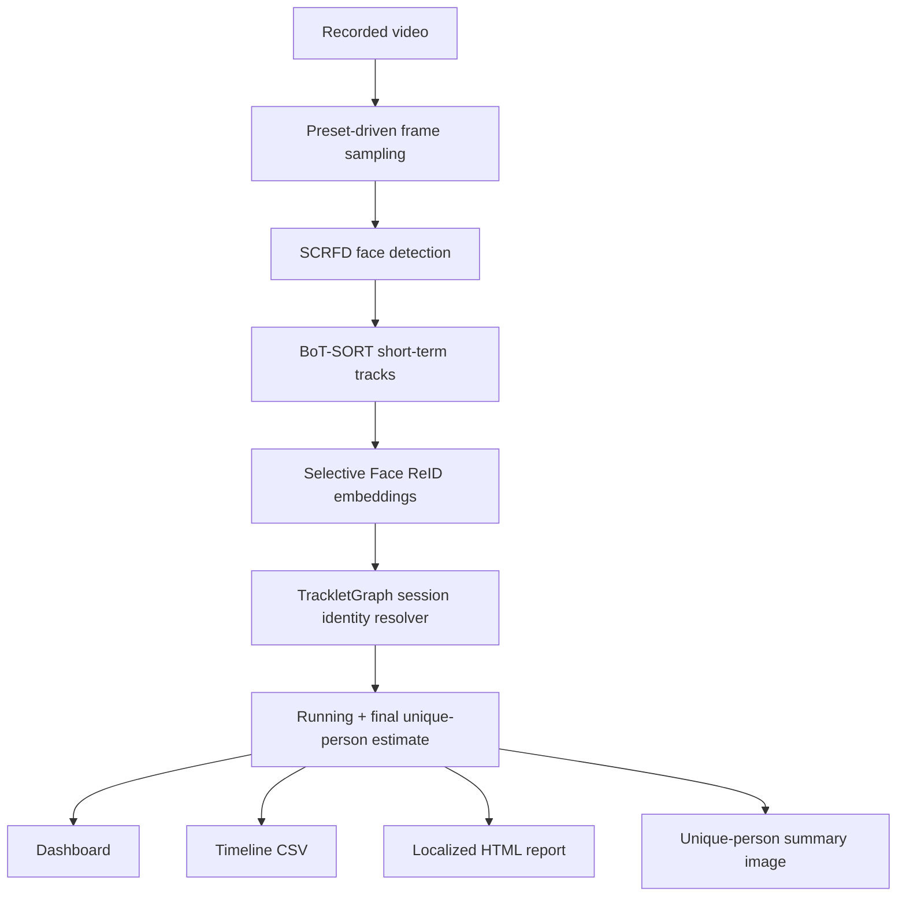
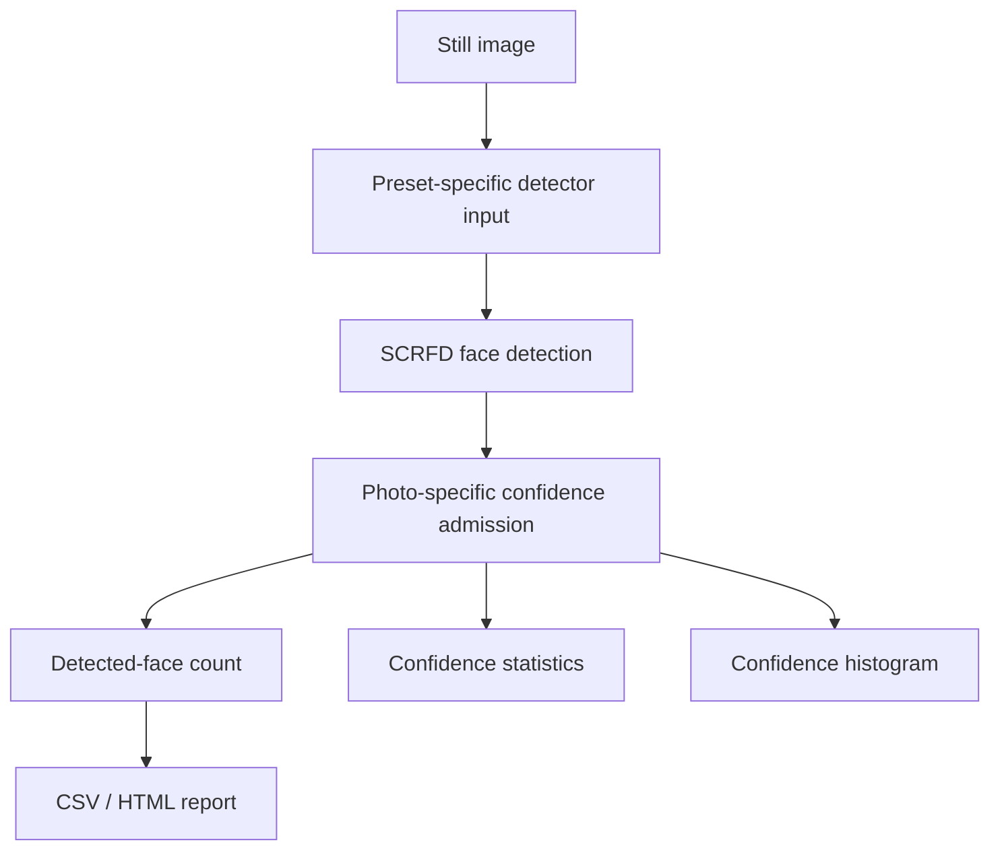
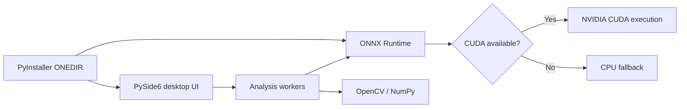

# Architecture

FaceTrack Analytics separates video identity estimation from photo face counting. The two modes share face detection infrastructure but intentionally do not share the same temporal logic.

## Video pipeline

### Responsibilities

- **SCRFD** provides per-frame face detections and confidence values.
- **BoT-SORT** provides short-term temporal continuity. A tracker ID is not treated as the final person identity.
- **Selective Face ReID** computes face embeddings only where identity evidence is needed rather than blindly on every visible face in every frame.
- **TrackletGraph** resolves session-level identity relationships and produces the final unique-person estimate. Its production implementation and calibrated rules are intentionally private.
- **Presentation/export** is separated from identity resolution: dashboard metrics, CSV, HTML reports, and the user-facing person summary consume analysis results rather than controlling identity decisions.

## Photo pipeline

Photo mode is deliberately single-frame. It does not use BoT-SORT or TrackletGraph temporal evidence.

## Runtime and packaging

The Windows release is an ONEDIR package so the executable, Qt runtime, ONNX Runtime, CUDA/cuDNN runtime libraries, assets, and model files can remain together as one portable folder.

## Public/private boundary

The public repository is intentionally a portfolio surface rather than a full production source release. It exposes product behavior, architecture, validation methodology, screenshots, schemas, and selected non-core UI code. It does not expose the production identity resolver, calibrated decision rules, private diagnostics, evaluation tooling, or model assets.
